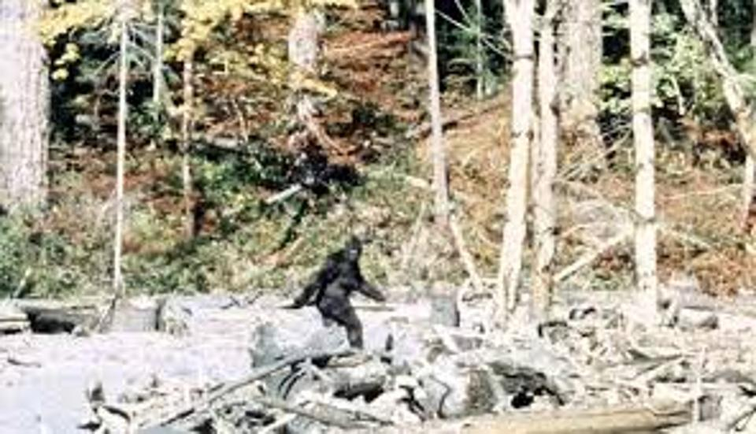

# Group_Project2
This Project was to show visualizations related to the amount of big foot sightings across the united states. For this project we used PostgreSQL to clean data that was pulled originally from https://www.bfro.net/GDB/classify.asp#classification.the web site was built using Boot strap CSS, the graphs were built using D3.js.
Contributors: 
Jackie Williams https://github.com/jwilli006
Firouz Karimov https://github.com/fkarimov69

